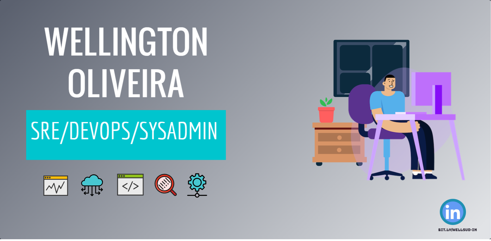

  
<table>
    <tr>
        <td></td>
        <td></td>
    </tr>   
</table>

  
- 👋 Hi, I’m Wellington Lima de Oliveira or @wellsud  
- 👀 I’m interested in SRE and automation in a general way. I'm ever interested in how can I avoid to do something that is not the most important thing  
- 🌱 I’m currently learning SRE, DevOps, Cloud, etc  

- 📫 How to reach me [here](https://www.linkedin.com/in/wellington-oliveira-devops/)

<!---
wellsud/wellsud is a ✨ special ✨ repository because its `README.md` (this file) appears on your GitHub profile.
You can click the Preview link to take a look at your changes.
--->
